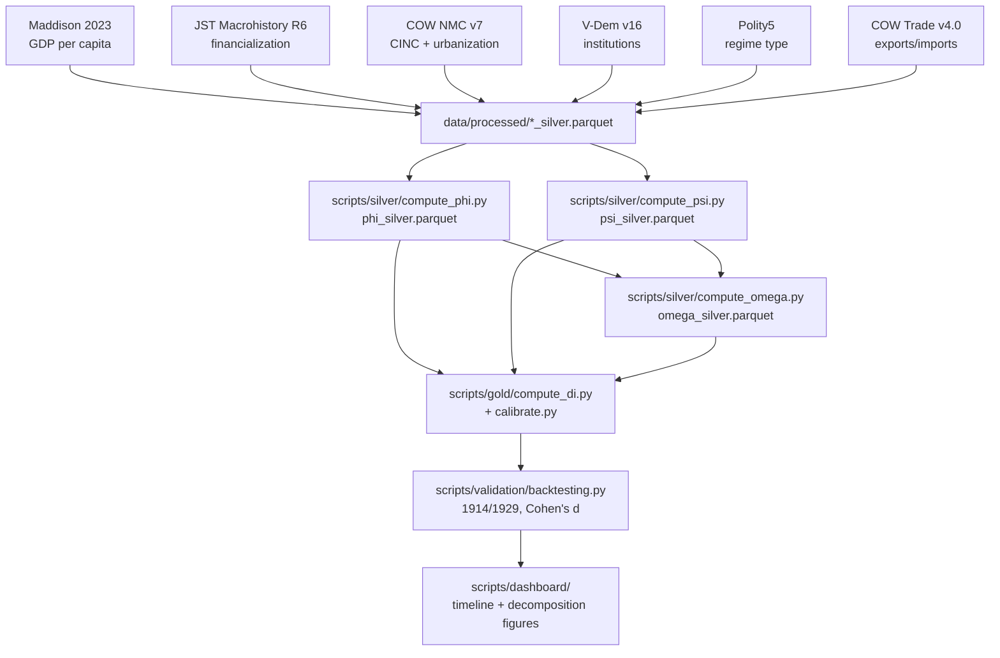

# Spengler-Wallerstein-Dashboard: Downfall Index

   

> A composite "Downfall Index" (DI) operationalizing Spengler's morphology of cultures, Wallerstein's world-systems theory, and cybernetic feedback principles into a single, historically-backtested measure of structural vulnerability.

`DI = Φ × (1 + α·Ψ) × (1 + β·Ω)`, rescaled to [0, 100], where **Φ** (Spengler) measures civilizational phase position, **Ψ** (Wallerstein) measures world-systems structural pressure, and **Ω** (cybernetics) measures 10-year momentum in both.

---

## Key findings — reported honestly, not oversold

- **Calibration is an unvalidated Phase 1 placeholder, not a fitted result**: a full 55-point grid search over (α, β) returned an *identical* loss at every combination — the "best" pair (α=0.1, β=0.1) is an arbitrary tie-break, not a genuine optimum. This is stated directly on every dashboard figure, not buried in a footnote.
- **Backtest: 1 of 3 historical transitions pass** — UKG's 1929 Depression shows a real pre-collapse divergence (Cohen's d = **1.69**); UKG's 1914 WWI transition does not (d = 0.27, below the d ≥ 0.5 threshold)
- 1848 European revolutions were **structurally excluded**, not glossed over: every bronze ingestion script floors at year 1870, so pre-1870 targets can never be tested against this data — documented in `docs/LIMITATIONS.md` rather than silently dropped from the target list
- Cohen's d uses proper sample-variance pooling (ddof=1) with bootstrap 95% confidence intervals, and the "peak must lead the transition" window is strict (`< event_year`, not `≤`) — an earlier version's peak-inclusive-of-event-year criterion was corrected during final review
- Missing-data artefacts (JST's 36.7%-null `fin_norm`, neutral-filled) visibly drive some of the sharpest early-period swings in the timeline figure — flagged directly on the chart, not left for a reader to discover independently

## Three layers

| Layer | Framework | Formula weight | What it measures |
|---|---|---|---|
| **Φ** (Phi) | Spengler | 25% fin, 20% urban, 20% polity, 15% phase, 10% mass society, 10% lifecycle | Civilizational phase position |
| **Ψ** (Psi) | Wallerstein | 25% hegemony, 20% terms-of-trade, 20% network centrality, 15% zone, 10% surplus, 10% cohesion | World-systems structural pressure |
| **Ω** (Omega) | Cybernetics | 25% d(fin), 25% d(hegemony), 20% d(network), 15% d(creativity), 15% d(terms-of-trade) | 10-year momentum, ∈ [−1, +1] |

---

## Architecture



## Medallion architecture

| Layer | Path | Contents |
|---|---|---|
| Bronze | `data/bronze/` | Raw files as downloaded, immutable |
| Silver | `data/processed/*_silver.parquet` | Per-source harmonized panels + Φ/Ψ/Ω composites |
| Gold | `data/gold/di_panel.parquet` | Final DI score, confidence flags, backtest report |

---

## Status

| Task | Result |
|---|---|
| 1–6 — Bronze ingestion | PASS — Maddison, JST, NMC, V-Dem, Polity5, COW Trade |
| 7–9 — Silver layers (Φ, Ψ, Ω) | PASS — a cross-cutting confidence-flag bug (`*_ci_wide` was broken in 3 different ways across all three layers) found and fixed before Gold construction |
| 10 — Gold DI formula + calibration | PASS with honest caveat — flat grid-search loss; α/β reported as placeholder |
| 11 — Backtesting | PASS (rescoped to 1914/1929 after the 1870 data-floor finding) — 1/3 targets pass |
| 12 — Dashboard | PASS — timeline + 4 decomposition figures, 300 DPI, full source attribution |

Full task-by-task detail, every finding, and every ruling in `docs/superpowers/plans/2026-06-25-downfall-index-phase1.md` and its progress ledger.

---

## Running it

```bash
conda env create -f environment.yml
python scripts/run_pipeline.py   # full bronze -> silver -> gold -> backtest -> dashboard
```

Figures land in `figures/`; the final panel and backtest report in `data/gold/`.
