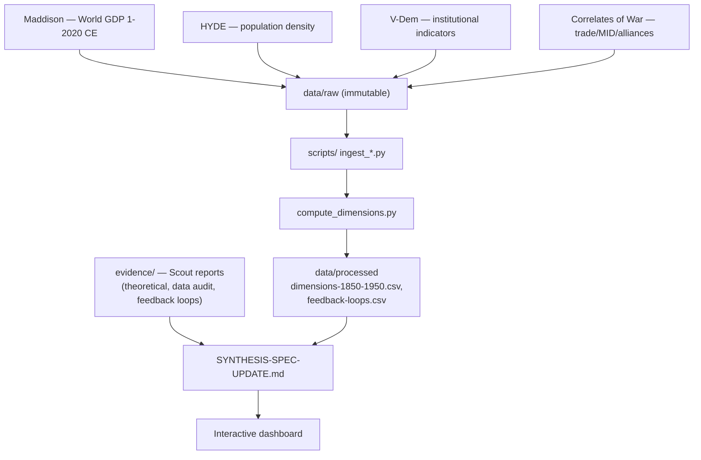

# Spengler-Wallerstein-Dashboard: Systems Critique Engine

**Project Goal**: Build a rigorous, interactive dashboard operationalizing Spengler's morphology of cultures, Wallerstein's world-systems theory, and cybernetic systems principles to identify feedback loops driving societal dysfunction. Deliver both peer-reviewed academic foundation and public-facing systems critique toolkit.

**Timeline**: 12+ months | **Team**: Solo (Andrei) orchestrator + AI agent fleet | **Status**: Phase 0 (Reconnaissance) Active

---

## Architecture



## Project Structure

```
Spengler-Wallerstein-Dashboard/
├── evidence/                           # Scout research reports & findings
│   ├── track-1-theoretical-validation.md     # Spengler/Wallerstein/cybernetics literature audit
│   ├── track-2-data-audit.md               # Data source inventory & quality assessment
│   ├── track-3-feedback-loops.md           # Feedback loop evidence & anomalies
│   ├── consolidated-inventory.md           # Cross-track synthesis
│   └── SYNTHESIS-SPEC-UPDATE.md            # Final evidence-based findings
│
├── data/
│   ├── raw/                          # Original datasets (immutable)
│   │   ├── maddison/                # World GDP, 1–2020 CE
│   │   ├── hyde/                    # Population density grids
│   │   ├── vdem/                    # V-Dem institutional indicators
│   │   ├── cow/                     # Correlates of War (trade, MID, alliances)
│   │   └── ...
│   └── processed/                   # Cleaned, merged, feature-engineered
│       ├── dimensions-1850-1950.csv # 20 dimensions × 4 epochs
│       ├── feedback-loops.csv       # Loop variables + indicators
│       └── ...
│
├── docs/
│   └── superpowers/
│       ├── specs/
│       │   └── 2026-06-23-spengler-wallerstein-cybernetic-synthesis.md
│       └── plans/
│           └── 2026-06-23-phase-0-reconnaissance.md
│
├── notebooks/                        # Exploratory analysis
│   ├── 01-eda-theoretical-landscape.ipynb
│   ├── 02-data-availability-audit.ipynb
│   └── ...
│
├── scripts/                          # Modular Python processing
│   ├── ingest_maddison.py
│   ├── ingest_vdem.py
│   ├── compute_dimensions.py
│   └── ...
│
├── references/                       # Bibliography & knowledge base
│   ├── spengler-operationalizations.bib
│   ├── wallerstein-empirical-studies.bib
│   └── cybernetics-systems-theory.bib
│
└── README.md (this file)
```

---

## Research Access & Resources

### SDU Library (Institutional Access)

As an MSc Data Science student at SDU Kolding, you have full access to:

- **JSTOR** (4 million+ peer-reviewed articles)
- **Springer Link** (2 million+ journals & books)
- **Taylor & Francis Online** (500+ journals)
- **SAGE Journals** (650+ titles)
- **ProQuest Dissertations & Theses** (historical academic work)
- **APA PsycINFO** (behavioral & social science literature)
- **EconLit** (economics & economic history)
- **Historical Abstracts & America: History & Life** (primary source indexing)

**Scout briefs will reference these resources.** Ensure scouts leverage institutional access when searching for:
- Spengler operationalizations (rare/specialized papers)
- Wallerstein empirical applications (econometric studies)
- Cybernetics in historical systems (advanced technical literature)

Access via: SDU login → library portal → database search

### Public/Open Access Repositories

- **Google Scholar** (free, includes institutional access when logged in)
- **arXiv** (preprints in economics, systems theory)
- **SSRN** (working papers in social science)
- **Semantic Scholar** (AI-powered paper discovery)
- **ResearchGate** (researcher networks; often free full-text)

---

## Phase 0: Reconnaissance & Validation (Active)

**Status**: Scout briefs finalized. Three parallel agents dispatch immediately.

**Expected completion**: 14 days (scouts run 5–7 days in background; synthesis + validation 2–3 days)

### Parallel Scout Work

- **Scout 1 (Theory)**: Spengler/Wallerstein/cybernetics operationalization literature audit
  - Output: `evidence/track-1-theoretical-validation.md`
  - Focus: Peer-reviewed operationalization attempts, success/failure, gaps
  
- **Scout 2 (Data)**: Data source audit for 20 dimensions
  - Output: `evidence/track-2-data-audit.md`
  - Focus: Coverage by epoch/region, quality scores, novel measurement opportunities

- **Scout 3 (Loops)**: Feedback loop validation & anomaly analysis
  - Output: `evidence/track-3-feedback-loops.md`
  - Focus: Empirical evidence, confidence tiers, historical anomalies, cybernetic insights

### Convergence (Day 10–14)

- Consolidate findings: `evidence/consolidated-inventory.md`
- Synthesize to spec update: `evidence/SYNTHESIS-SPEC-UPDATE.md`
- Final readiness assessment: `IMPLEMENTATION-READINESS.md`
- User approval → Phase 1 kickoff

---

## Data Sources (Borrowed, Validated)

| Dataset | Epochs | Coverage | Quality | Access |
|---------|--------|----------|---------|--------|
| **Maddison Project Database 2020** | 1–2020 CE | 169 countries | High (1800+) | Free download |
| **HYDE 3.2** | 10000 BCE–2017 | Global, 5' resolution | Medium (pre-1500), High (1800+) | Free |
| **V-Dem v13** | 1789–2023 | 202 countries | High | Free |
| **COW Trade** | 1870–2014 | Bilateral trade | High | Free |
| **World Bank GFDD** | 1960–2020 | 200+ countries | High | Free API |
| **OECD Data** | 1960–present | OECD + partner countries | High | Free |
| **Eurostat** | 1995–present | EU + EEA | Very High | Free |
| **Penn World Table** | 1950–2019 | 183 countries | High | Free |

**All data immutable in `data/raw/`; processed versions in `data/processed/`**

---

## Key Contacts & Decision Gates

**Project Orchestrator**: Andrei Manoloiu  
**Decision Points**:
- Phase 0 → Phase 1: User reviews evidence quality + readiness assessment
- Phase 1 → Phase 2: Dashboard MVP validated on 1850–1950 data
- Phase 2+ : Academic paper draft ready for peer review

---

## Next Steps (Immediate)

1. ✓ Project structure created
2. ✓ Spec & plan committed to project
3. **→ Dispatch three scouts (Subagent-Driven)**
4. **→ Monitor progress (daily checkpoint)**
5. **→ Synthesize findings (Day 10)**
6. **→ User review & Phase 1 approval (Day 14)**

**When ready, confirm: "Launch scouts now"**
